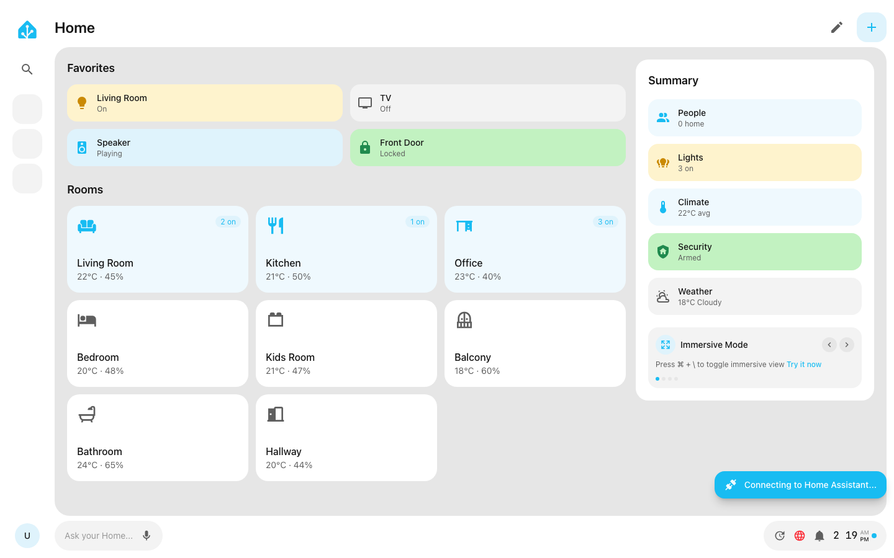
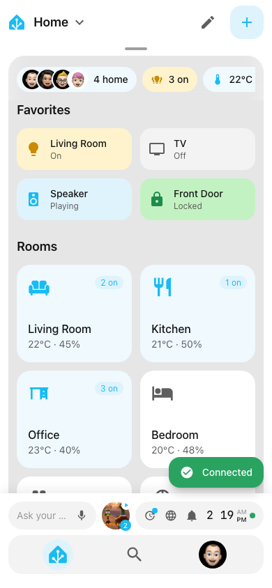

# Home Assistant Next.js Dashboard

A touch-friendly Home Assistant dashboard built with Next.js, featuring real-time WebSocket connectivity, room-based navigation, entity cards, pull-to-reveal panels, an idle screensaver, and a responsive mobile/desktop layout.

## Screenshots

### Desktop



### Mobile

<p align="center">
  
</p>

## Getting Started

First, run the development server:

```bash
npm run dev
```

Open [http://localhost:3000](http://localhost:3000) with your browser to see the result.

## Deploy on Vercel

The easiest way to deploy your Next.js app is to use the [Vercel Platform](https://vercel.com/new?utm_medium=default-template&filter=next.js&utm_source=create-next-app&utm_campaign=create-next-app-readme) from the creators of Next.js.

Check out the [Next.js deployment documentation](https://nextjs.org/docs/app/building-your-application/deploying) for more details.
